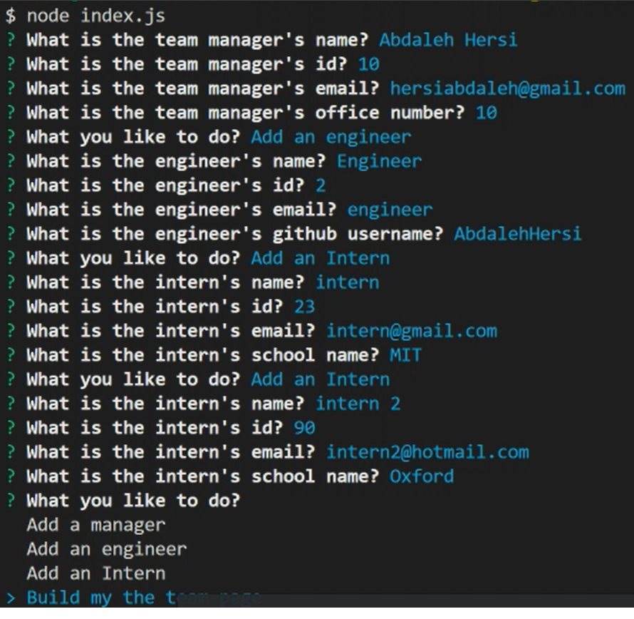

# Jubilant-Dubious-System

# Description

The Jubilant-Dubious-System is a command line application that takes user input of different employees, dynamically creates a web page and displays it. It asks you a set of questions 

# Links

[My github profile](https://github.com/AbdalehHersi)

[Jubilant-Dubious-System](https://github.com/AbdalehHersi/jubilant-dubious-system)

# Installation

Before you can use the program, you must have [Node.js](https://nodejs.org/en/download/), [Inquirer](https://www.npmjs.com/package/inquirer) and [Jest](https://www.npmjs.com/package/jest)package installed. You can download [Node.js](https://nodejs.org/en/download/) from the Node download web page or clicking on [this link](https://radixweb.com/blog/installing-npm-and-nodejs-on-windows-and-mac) for a more in-depth guide. 

Clone the repository code to a location of your choice using the command-line interface of your choice. Once you have done that, use `npm i` or `npm install` command-line interface on the same root level as the `package.json`. After that you should be good to go.

# Usage

To run the program all you need to do is enter `node index.js` Answer all the prompts and the README file will be generated. 




For a more in depth guide you can view this walkthrough.

[Video](https://drive.google.com/file/d/1igDnduEJHjnXbV6v4c8PGNl19Z1_3jRq/view)

# Challenge acceptance criteria

```
GIVEN a command-line application that accepts user input
WHEN I am prompted for my team members and their information
THEN an HTML file is generated that displays a nicely formatted team roster based on user input
WHEN I click on an email address in the HTML
THEN my default email program opens and populates the TO field of the email with the address
WHEN I click on the GitHub username
THEN that GitHub profile opens in a new tab
WHEN I start the application
THEN I am prompted to enter the team manager’s name, employee ID, email address, and office number
WHEN I enter the team manager’s name, employee ID, email address, and office number
THEN I am presented with a menu with the option to add an engineer or an intern or to finish building my team
WHEN I select the engineer option
THEN I am prompted to enter the engineer’s name, ID, email, and GitHub username, and I am taken back to the menu
WHEN I select the intern option
THEN I am prompted to enter the intern’s name, ID, email, and school, and I am taken back to the menu
WHEN I decide to finish building my team
THEN I exit the application, and the HTML is generated
```